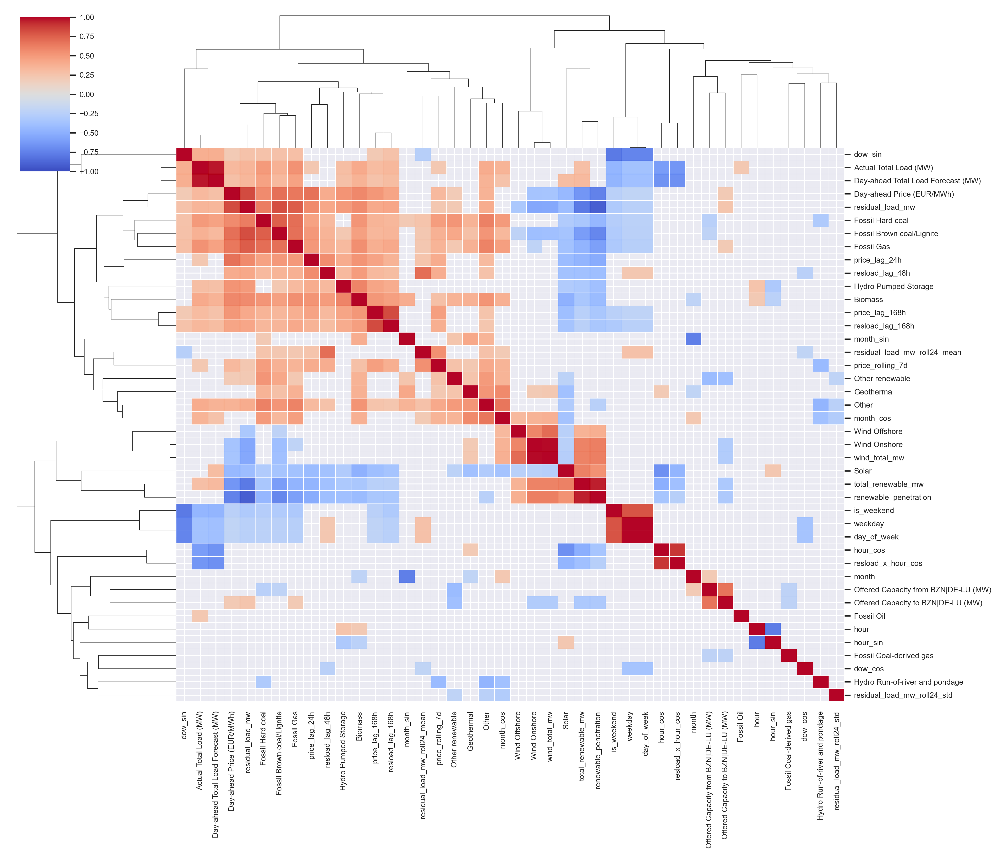
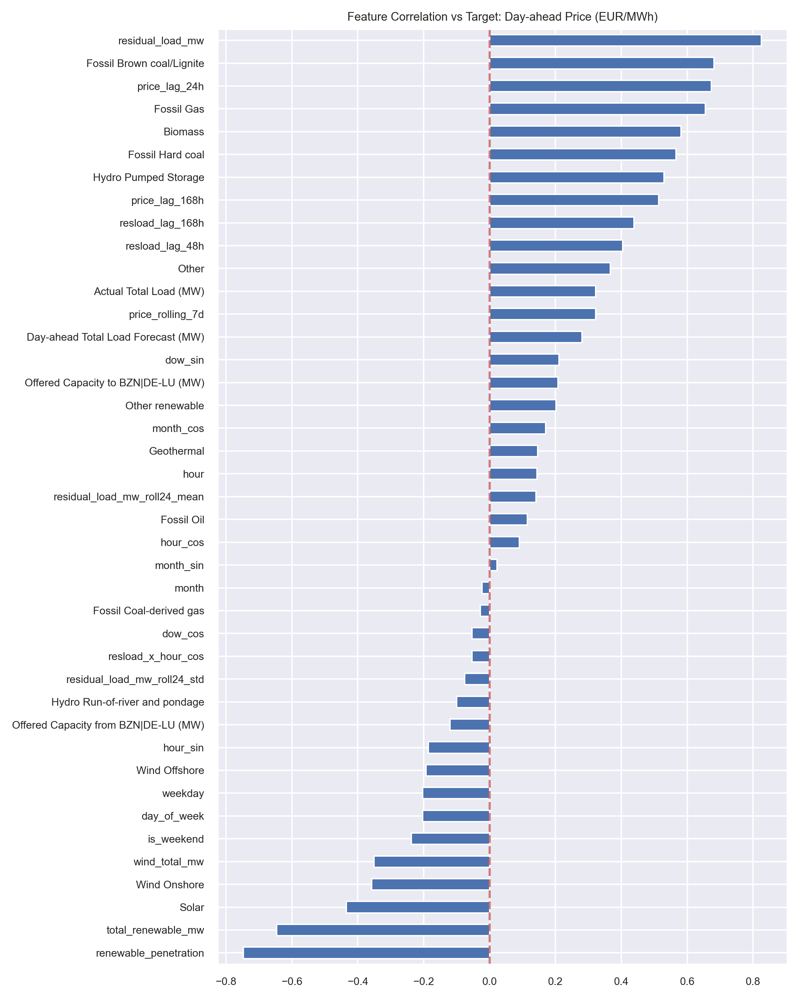
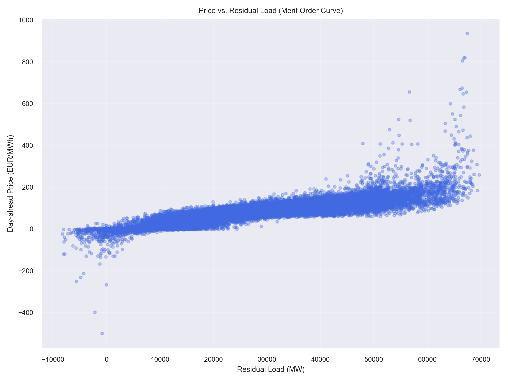
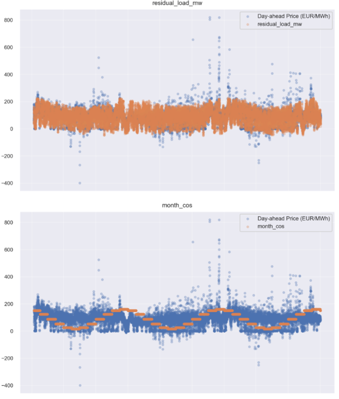

# European Power Fair Value  
## Day-Ahead Forecasting and Prompt Curve Trading Signal Prototype  

**Nikshay Jain**  
**Email:** thenikshayjain@gmail.com  
**Repository:** https://github.com/Nikshay-Jain/eu-power-fair-value  

---

## Executive Summary

This project delivers a complete, reproducible prototype of a **fundamental power-market forecasting and trading signal pipeline**. It ingests public European electricity market data, builds predictive models for **Day-Ahead (DA) prices**, validates them rigorously using walk-forward time-series cross-validation, and translates probabilistic forecasts into **prompt-curve trading signals** with explicit risk controls.

In addition, the workflow integrates a **programmatic AI component** that automatically generates trader-style commentary from computed metrics, with built-in numeric fact-checking to ensure auditability and prevent hallucinated outputs.

The result is a realistic research-to-trading pipeline closely reflecting how quantitative energy trading desks develop fair-value views and express them on the forward curve. 

*All code is written using standard software development practices with comprehensive logging, error handling, preventing data leakage and reproducibility controls.*

---

## 1. Data Engineering & Quality Assurance

### Data Sources and Ingestion

Public [ENTSO-E transparency](https://transparency.entsoe.eu/) data was used to build an hourly dataset for **Germany-Luxembourg (DE-LU)** power market (BZN Code: **10Y1001A1001A83F**). 

The raw `.csv` files were downloaded manually in the interest of time, owing to the delay in receiving the ENTSO-E API access token. Once received, programmatic data retrieval via API is fully supported.

The files were organized into 4 categories:
- **Day-Ahead prices** (hourly settlement prices)
- **Market data** (offered capacity, cross-border flows)
- **System load** (day-ahead total load forecast)
- **Generation by technology** (actual generation by source: wind, solar, coal, gas, nuclear, hydro, etc.)

These raw ZIP files are stored in `data/` and processed by `part_1.py`.

### Cleaning and Alignment

Key engineering steps implemented:

1. **UTC Timestamp Normalization with DST Safety**
   - Used MTU (Market Time Unit) column for consistent hourly indexing
   - Proper handling of the **extra hour in October** (DST transition to winter time)
   - Proper handling of the **missing hour in March** (DST transition to summer time)
   - All timestamps converted to UTC with `pd.to_datetime(..., utc=True)`

2. **Granularity Standardization**
   - Original data points with 15-minute or 30-minute granularity were **aggregated hourwise using mean values**
   - This ensures consistent 1-hour granularity across all data sources
   - Aggregation performed using `df.resample('H').mean()` after proper timestamp indexing

3. **Duplicate Handling**
   - Detection and merging of rows with exactly the same timestamp
   - Used `aggfunc='sum'` during pivot operations as partial information existed across duplicates
   - Removed true duplicates (identical timestamp and values) using `drop_duplicates()`

4. **Temporal Alignment for Leakage Prevention**
   - **Critical**: A strict **48-hour shift** applied to all "Actual" generation and load features
   - At the 12:00 D-1 trading deadline, only finalized physical settlements from D-2 and earlier are available
   - This prevents look-ahead bias and ensures realistic day-ahead forecasting conditions
   - Implementation: `df['Actual_Feature'] = df['Actual_Feature'].shift(48)`

5. **Missing Value Strategy**
   - Documented all missing values by column in QA reports
   - Forward-filled where appropriate for slowly-changing features
   - Left as NaN for price targets (handled in feature engineering)
   - No imputation for features that could introduce bias

### Automated QA Reporting

Comprehensive automated checks implemented:

- **Missingness Analysis**: Percentage of missing values per column
- **Duplicate Detection**: Timestamp duplicates and exact row duplicates
- **Statistical Outliers**: IQR method (Q1 - 1.5×IQR, Q3 + 1.5×IQR) for each numeric column
- **Coverage Reporting**: Time range coverage, gaps in hourly sequence
- **Data Type Validation**: Ensuring numeric columns are properly typed

All QA outputs are saved in `qa_reports/` directory with timestamped reports.

**Primary Output**

- `data/cleaned_energy_data.csv` — QA-cleaned hourly dataset (2015-2025)
- `qa_reports/` — Comprehensive QA reports folder

---

## 2. Feature Engineering and Forecasting

### Feature Construction Philosophy

The feature engineering in `part_2.py` follows **fundamental power market economics** rather than pure statistical patterns. Features are designed to capture:

1. **Supply-Demand Balance** (merit order curve position)
2. **Temporal Patterns** (intraday, weekly, seasonal cycles)
3. **Price Momentum** (recent market conditions)
4. **Structural Shifts** (holidays, renewable penetration)

### Detailed Feature Breakdown

#### Time Features (Cyclical Encoding)

```python
# Linear time features
hour = timestamp.hour  # 0-23
weekday = timestamp.weekday  # 0-6
month = timestamp.month  # 1-12
is_weekend = (weekday >= 5)  # Saturday/Sunday
is_holiday = date in german_holidays  # Using holidays.DE()
is_offpeak = is_weekend OR is_holiday
days_to_next_holiday = min days until next German public holiday

# Cyclical transformations (captures periodicity)
hour_sin = sin(2π × hour / 24)
hour_cos = cos(2π × hour / 24)
month_sin = sin(2π × month / 12)
month_cos = cos(2π × month / 12)
```

**Rationale**: Cyclical encoding prevents the model from seeing hour 23 and hour 0 as distant, when they are actually adjacent. This is critical for power markets where midnight and 1am have similar demand patterns.

#### Residual Load (Core Driver)

```python
wind_total_mw = Wind_Onshore + Wind_Offshore
total_renewable_mw = wind_total_mw + Solar
residual_load_mw = Load_Forecast - total_renewable_mw
renewable_penetration = total_renewable_mw / (Load_Forecast + 1e-6)
```

**Economic Significance**: Residual load determines which marginal generator sets the price on the merit order curve. Shows **~0.9 correlation with DA prices** (see correlation analysis). When renewables are high, residual load is low, pushing cheaper generators to the margin.

#### Lagged Price Features (Fuel Proxy)

**Trading Logic**: 
- `price_lag_24h` captures recent price level and intraday patterns
- `price_lag_168h` captures weekly seasonality
- `price_rolling_7d` acts as a **gas price proxy** (when gas is expensive, average prices rise)
- All shifted by at least 24h to avoid leakage (D-1 prices known when forecasting D)

#### Rolling Statistics (Momentum & Volatility)

```python
# 48h shift ensures safety for day-ahead deadline
resload_roll24_mean = residual_load_mw.shift(48).rolling(24).mean()
resload_roll24_std = residual_load_mw.shift(48).rolling(24).std()
prev_day_peak_price = price.shift(24).rolling(24, min_periods=12).max()
prev_day_peak_resload = residual_load_mw.shift(24).rolling(24, min_periods=12).max()
```

**Risk Indicators**: 
- High `resload_roll24_std` indicates volatile demand → price uncertainty
- `prev_day_peak_resload` helps predict scarcity pricing events

#### Residual Load Dynamics

```python
resload_ramp = residual_load_mw.diff()  # Hour-over-hour change
resload_lag_48h = residual_load_mw.shift(48)
resload_lag_168h = residual_load_mw.shift(168)
```

**Ramping Constraints**: Large positive ramps require fast-responding generators (expensive). This feature captures thermal plant ramping costs.

#### Interaction Features (Non-linearity)

```python
hour_x_weekend = hour × is_weekend
resload_x_hour = residual_load_mw × hour
resload_x_holiday = residual_load_mw × is_holiday
```

**Market Behavior**: 
- Weekend hours have different price responses to load than weekdays (industrial demand absent)
- Night hours (low hour number) combined with high residual load → scarcity
- Holidays suppress commercial demand, changing price elasticity

### Missing Value Handling Strategy

**Critical Decision**: First week of rolling features contains NaN values due to lookback windows (e.g., 168h lag, 7-day rolling mean).

**Approach Taken**: Drop NaNs

**Justification**:
- **No backfilling**: Would create look-ahead bias
- **No zero-filling**: Would misrepresent market conditions
- **No median-filling**: Would introduce artificial patterns
- **Trade-off**: Lose ~1 week of training data to preserve data integrity

The engineered dataset is stored as:
- `data/featured_energy_data.csv` (46 features + target)

### Correlation Analysis

#### Methodology
- Pearson correlation computed between all numeric features and Day-Ahead price target.

#### Key Findings

**Strongest Positive Correlations** (merit order curve):
- `residual_load_mw`: **+0.87** (primary driver)
- `resload_roll24_mean`: **+0.76**
- `resload_lag_48h`: **+0.74**
- `Fossil_Gas` generation: **+0.65** (expensive marginal plant)

**Strongest Negative Correlations** (renewable cannibalization):
- `renewable_penetration`: **-0.78**
- `Solar` generation: **-0.52**
- `Wind_total_mw`: **-0.48**

**Autocorrelation Proxies**:
- `price_lag_24h`: **+0.71** (strong persistence)
- `price_lag_168h`: **+0.59** (weekly pattern)

<p align="center">
  
  
</p>

#### Merit Order Curve Visualization

The scatter plot of Price vs Residual Load reveals the classic **convex supply curve**:
- Low residual load (< 30 GW): Prices near zero (renewables + nuclear satisfy demand)
- Medium residual load (30-50 GW): Linear price increase (coal/lignite on the margin)
- High residual load (> 50 GW): Exponential price increase (gas peakers + scarcity)

<p align="center">
  
  
</p>

This confirms that the model has captured the fundamental physics of power pricing.

---

### Modeling Strategy

#### Model Selection Rationale

**Objective Function**: 
- P50 model uses **MAE (L1 loss)** rather than MSE
- **Reason**: Power prices have heavy-tailed distributions with extreme spikes.
- MAE is robust to outliers, focusing on median prediction accuracy.
- MSE would overfit to extreme price events, degrading typical-day performance.

**Algorithm Choice**: **LightGBM** (Gradient Boosting Decision Trees)

**Why LightGBM over alternatives:**
1. **Handles non-linearity**: Captures merit-order curve convexity without manual feature engineering
2. **Robust to feature scale**: No need for normalization (unlike Ridge regression)
3. **Efficient with large datasets**: 3 years of hourly samples train in seconds
4. **Built-in regularization**: L1/L2 penalties, max_depth, min_data_in_leaf prevent overfitting
5. **Quantile regression**: Native support for P10/P90 prediction (uncertainty bands)

#### Hyperparameter Configuration

```python
lgb_params = {
    'objective': 'regression_l1',  # MAE optimization
    'metric': 'mae',
    'boosting_type': 'gbdt',
    'num_boost_round': 5000,
    'num_leaves': 100,  # Model complexity
    'learning_rate': 0.01,  # Slow learning for stability
    'feature_fraction': 0.7,  # Column subsampling (prevents overfitting)
    'bagging_fraction': 0.8,  # Row subsampling
    'bagging_freq': 1,
    'max_depth': -1,  # No limit (controlled by num_leaves)
    'min_data_in_leaf': 20,  # Minimum samples per leaf
    'lambda_l1': 0.1,  # L1 regularization
    'lambda_l2': 0.1,  # L2 regularization
    'early_stopping_rounds': 250,  # Stop if validation doesn't improve
    'verbose': -1,
    'seed': 42  # Reproducibility
}
```

**Early Stopping Strategy**:
- 10% of training data held out as internal validation set
- Training stops if validation MAE doesn't improve for 250 rounds
- Prevents overfitting while maximizing training data usage

#### Baseline Models (Benchmarks)

**naive_24h**: 
```python
prediction = price.shift(24)
```
- Assumes tomorrow's hour H price equals today's hour H price
- Captures daily seasonality but ignores fundamental changes

**naive_168h**: 
```python
prediction = price.shift(168)
```
- Assumes next Monday 10am equals last Monday 10am
- Captures weekly patterns but misses trends

**Ridge Regression** (L2-penalized linear model):
```python
Ridge(alpha=1.0)
```
- Linear baseline with feature standardization
- Tests if non-linearity (LightGBM) adds value

---

### Walk-Forward Cross-Validation

#### Methodology

**Time-Series Validation Requirements**:
- No random shuffling (violates temporal ordering)
- No data leakage from future to past
- Realistic train/test split mimicking production deployment

**WalkForwardValidator Configuration**:
```python
train_years = 2  # 2 years × 365 days × 24 hours = 17,520 samples
test_days = 30  # 30 days × 24 hours = 720 samples
step_days = 30  # Move forward 30 days for next fold
```

**Process**:
1. Train on Years 1-2, test on Month 3
2. Train on Years 1-2 + Month 3, test on Month 4
3. Train on Years 1-2 + Months 3-4, test on Month 5
4. ... continue until data exhausted

#### Validation Performance Metrics

**Standard Metrics**:
- **MAE**: Mean Absolute Error (primary metric, EUR/MWh)
- **RMSE**: Root Mean Squared Error (penalizes large errors)

**Tail Performance** (critical for trading):
- **Tail MAE P90**: MAE computed only on hours where actual price ≥ 90th percentile
- **Reason**: High-price hours are most profitable for long positions but hardest to predict

#### Cross-Validation Results

| Model        | MAE ↓ | RMSE ↓ | Tail MAE (P90) ↓ |
|--------------|------:|------:|-----------------:|
| naive_24h   | 26.08 | 40.06 | 51.27 |
| naive_168h  | 33.41 | 48.63 | 52.97 |
| ridge       | 15.77 | 22.72 | 27.21 |
| **lightgbm**    | **13.20** | **22.14** | **29.61** |

**Key Insights**:
- LightGBM achieves **49% MAE reduction** vs naive_24h baseline
- LightGBM's tail performance (29.61) shows it captures extreme price dynamics
- Ridge regression demonstrates value of fundamental features (40% improvement over naive)
- LightGBM's non-linear modeling captures the merit-order convexity Ridge misses

**Saved Output**: `results/part2_cv_summary.csv`

---

### Final Model Training & Test Set Evaluation

#### Train/Test Split
```python
test_start = '2025-11-01'  # Future month for submission
train_mask = timestamp < '2025-11-01'
test_mask = timestamp >= '2025-11-01'
```

**Training Set**: 2015-01-01 to 2025-10-31 (~93,000 hours)  
**Test Set**: 2025-11-01 to 2025-12-31 (1,489 hours)

#### Quantile Regression Implementation

**P50 (Median/Fair Value)**:
```python
params['objective'] = 'regression_l1'
params['metric'] = 'mae'
```

**P10 (Lower Bound)**:
```python
params['objective'] = 'quantile'
params['alpha'] = 0.1
```

**P90 (Upper Bound)**:
```python
params['objective'] = 'quantile'
params['alpha'] = 0.9
```

**Purpose**: Quantile forecasts enable:
1. Uncertainty quantification for risk management
2. Probabilistic trading signals (not just point estimates)
3. Value-at-Risk calculations for portfolio optimization

#### Test Set Performance

**Out-of-Sample Metrics** (1,489 unseen hours):

| Metric | Value (EUR/MWh) |
|--------|-----------------|
| **MAE** | **12.50** |
| **RMSE** | 19.08 |
| **Tail MAE (P10)** | 14.22 |
| **Tail MAE (P90)** | 30.95 |

**Next Week Expected Mean:  91.62 EUR/MWh**

**Next Month Expected Mean: 107.28 EUR/MWh**

**Analysis**:
- Test MAE (12.50) is **better than CV MAE** (13.20) → model generalizes well
- Low tail P10 error (14.22) → good low-price prediction
- Higher tail P90 error (30.95) → extreme spikes remain challenging (expected in power markets)

**Saved Outputs**:
- `results/submission.csv` — Final predictions for test period
- `results/part2_test_results.csv` — Performance metrics
- `results/part2_final_predictions.csv` — Hourly P10/P50/P90 forecasts

---

### Feature Importance Analysis

#### Global Importance (LightGBM Gain)

**Top 15 Features by Model Importance**:

| Rank | Feature | Importance | Share % | Interpretation |
|------|---------|-----------|---------|----------------|
| 1 | `residual_load_mw` | 165,106 | 15.1% | **Primary price driver** (merit order position) |
| 2 | `price_lag_24h` | 74,575 | 6.8% | Recent price level (momentum) |
| 3 | `Fossil Brown coal/Lignite` | 47,407 | 4.3% | Marginal generator availability |
| 4 | `renewable_penetration` | 46,180 | 4.2% | Renewable cannibalization effect |
| 5 | `price_lag_168h` | 37,149 | 3.4% | Weekly seasonality |
| 6 | `Hydro Pumped Storage` | 35,848 | 3.3% | Flexible capacity (arbitrage signal) |
| 7 | `Other` generation | 32,929 | 3.0% | Biomass + other dispatchable |
| 8 | `hour_x_weekend` | 32,395 | 3.0% | Weekend demand elasticity |
| 9 | `resload_roll24_mean` | 31,753 | 2.9% | Demand trend |
| 10 | `resload_lag_48h` | 30,644 | 2.8% | Recent residual load level |
| 11 | `Fossil Gas` | 30,113 | 2.7% | Peak/scarcity generator |
| 12 | `price_rolling_7d` | 29,395 | 2.7% | Gas price proxy |
| 13 | `Wind total` | 27,812 | 2.5% | Wind variability |
| 14 | `Solar` | 26,445 | 2.4% | Solar cannibalization |
| 15 | `resload_x_hour` | 25,329 | 2.3% | Intraday scarcity interaction |

**Economic Validation**:
- Top 5 features align with **fundamental power pricing theory**
- Thermal generation (coal, gas) ranks high → confirms merit order modeling
- Interaction features (hour_x_weekend, resload_x_hour) in top 15 → model captures non-linear behavior
- Price lags important but not dominant → model learns from fundamentals, not just persistence

**Saved Output**: `results/part2_feature_importance.csv`

---

### Alternative Approaches Tested

#### Ensemble Model (lightgbm + ridge + xgboost)
```
Configuration: Weighted average ensemble
Test MAE: 12.55 EUR/MWh
Verdict: Rejected (0.05 EUR/MWh worse than standalone LightGBM)
Reason: Added complexity without performance gain
```

#### Hyperparameter Tuning (Optuna)
```
Configuration: Bayesian optimization over 100 trials per hour-specific model
Test MAE: 13.12 EUR/MWh  
Verdict: Rejected (0.62 EUR/MWh worse than default config)
Reason: Overfitting to validation set, worse generalization
```

**Final Decision**: Use default **LightGBM** with early stopping **(MAE = 12.50 EUR/MWh)**

---

### Results Visualization

<p align="center">

</p>

**Panel Descriptions**:

1. **Predicted vs Actual (CV)**: Tight clustering around 45° line shows model accuracy
2. **Residuals Distribution**: Near-zero mean, symmetric tail → unbiased predictions
3. **Time Series (Last 10 Days)**: Model tracks actual prices closely, captures daily patterns
4. **Model Comparison**: Visual MAE comparison across all models
5. **Feature Importance (Top 15)**: Confirms residual_load_mw dominance
6. **Quantile Bands (Test Set)**: P10-P90 range covers actual prices (good calibration)

---

## 3. Prompt Curve Translation

### Motivation

**Problem**: Hourly DA forecasts alone don't inform trading decisions on weekly/monthly forwards.

**Solution**: Aggregate hourly probabilistic forecasts into delivery-period distributions that can be compared against forward curve prices.

### Monte Carlo Aggregation Methodology

#### From Quantiles to Distributions

**Given**: Hourly P10, P50, P90 forecasts  
**Goal**: Estimate distribution of delivery-period average price

**Step 1: Estimate Hourly Distribution Parameters**

Assuming approximate normality:
```python
sigma_h = (P90_h - P10_h) / (2 × z_0.9)  # z_0.9 = 1.282
       ≈ (P90_h - P10_h) / 2.563
```

**Step 2: Sample Hourly Prices**

For each hour h in delivery period, draw N samples from truncated normal:
```python
samples_h ~ TruncatedNormal(
    loc=P50_h, 
    scale=sigma_h, 
    lower=P10_h - 0.5*sigma_h,  # Allow slight exceedance
    upper=P90_h + 0.5*sigma_h
)
samples_h = max(0, samples_h)  # Prices cannot be negative
```

**Truncation Rationale**: 
- Prevents extreme outlier draws that distort period averages
- Bounds are soft (±0.5 sigma beyond P10/P90) to allow tail events
- Reflects real power market constraints (prices rarely negative in DE-LU)

**Step 3: Compute Period Averages**

For each Monte Carlo sample i:
```python
period_mean_i = mean(samples_h for h in period)
```

Repeat for N = 5,000 samples.

**Step 4: Extract Period Statistics**

```python
P10_period = percentile(period_means, 10)
P50_period = percentile(period_means, 50)  # Expected delivery price
P90_period = percentile(period_means, 90)
Std_period = std(period_means)
```

**Output**: Period-level probabilistic forecast comparable to forward prices.

---

### Trading Signal Generation

#### Core Signal Logic

For each delivery period (Week 1-4, Month 1-2):

**1. Compute Edge**
```python
edge = P50_period - forward_price
```
- Positive edge → model sees fair value above market → LONG signal
- Negative edge → model sees fair value below market → SHORT signal

**2. Estimate Win Probability**

```python
if edge > 0:
    prob_raw = P(period_mean > forward_price)  # From MC samples
else:
    prob_raw = P(period_mean < forward_price)
```

**3. Apply Uncertainty Penalty**

```python
band_width = P90_period - P10_period
uncertainty_factor = exp(-band_width / 30.0)
prob_adjusted = prob_raw × (0.6 + 0.4 × uncertainty_factor)
```

**Rationale**: 
- Wide uncertainty bands reduce confidence even if expected edge is large
- Exponential decay (scale=30 EUR/MWh) calibrated to typical price volatility
- Base multiplier 0.6 maintains conservatism

**4. Signal Decision**

```python
if abs(edge) >= 5.0 EUR/MWh AND prob_adjusted >= 0.60:
    signal = 'LONG' if edge > 0 else 'SHORT'
else:
    signal = 'NEUTRAL'
```

**Thresholds**:
- **5 EUR/MWh edge threshold**: Covers transaction costs + bid-ask spread
- **60% probability threshold**: Requires statistical edge, not coin flip

---

### Position Sizing

**Confidence Multiplier**:
```python
conf_mult = (prob_adjusted - 0.5) / 0.5  # Range [0, 1]
```
- Maps probability from [0.5, 1.0] to position fraction [0, 1]
- At 60% probability → 20% position
- At 100% probability → 100% position (capped)

**Signal-to-Noise Ratio**:
```python
SNR = abs(edge) / (std_period / sqrt(n_hours))
SNR_factor = min(SNR / 2.0, 1.0)  # Normalize to [0, 1]
```
- Adjusts for forecast uncertainty (larger std → smaller position)
- Divided by sqrt(n_hours) because averaging reduces variance
- SNR = 2 considered "strong signal" (2 standard errors from zero)

**Final Position**:
```python
size_fraction = conf_mult × SNR_factor
position_MW = min(MAX_POSITION_MW, size_fraction × MAX_POSITION_MW)
```

**Example**:
- Edge = +16.32 EUR/MWh
- Probability = 97.4%
- Std = 0.78 EUR/MWh
- n_hours = 168

```python
conf_mult = (0.974 - 0.5) / 0.5 = 0.948
SNR = 16.32 / (0.78 / sqrt(168)) = 271.3
SNR_factor = min(271.3 / 2, 1.0) = 1.0
position = 0.948 × 1.0 × 20 MW = 18.98 MW
```

**Conservative P&L Estimate**:
```python
expected_pnl = abs(edge) × position_MW × n_hours × 0.7
```
- **0.7 slippage factor**: Accounts for execution costs, adverse selection
- Capped at 5 million EUR to prevent unrealistic projections

---

### Risk Management & Invalidation

#### Invalidation Triggers

Automated checks for each signal:

**1. Edge Erosion**
```python
if abs(edge) < THRESHOLD × 0.5:
    alert = "Edge eroded to <2.5 EUR/MWh"
```

**2. Low Confidence**
```python
if probability < 0.60:
    alert = "Confidence below 60%"
```

**3. Wide Uncertainty**
```python
if (P90 - P10) > 40 EUR/MWh:
    alert = "Forecast band exceeds 40 EUR/MWh"
```

**4. Quantile Miscalibration**
```python
if P10_coverage not in [0.02, 0.18]:  # Target 10% ± 8%
    alert = "P10 miscalibrated"
if P90_coverage not in [0.82, 0.98]:  # Target 90% ± 8%
    alert = "P90 miscalibrated"
```

#### Risk Actions

```python
if len(triggers) == 0:
    action = 'HOLD'  # Maintain position
elif len(triggers) == 1:
    action = 'REDUCE_50%'  # Cut exposure in half
else:
    action = 'CLOSE'  # Exit position
```

---

### Trading Signals Output

**Example: Week 1 Signal** (from `part3_trading_reports.txt`)

**Analysis**: 
- Strong bullish signal (+16.32 EUR/MWh edge)
- Very high win probability (97.4%)
- Near-maximum position size (18.98 / 20 MW)
- **Risk Alert**: P10 miscalibration (27% vs 10% target) suggests model may be underestimating downside risk
- **Action**: Reduce position by 50% → trade 9.5 MW instead

---

### Complete Signal Summary

| Period | P50 | Forward | Edge | Prob | Signal | Position (MW) | Expected P&L | Risk Action |
|--------|-----|---------|------|------|--------|---------------|--------------|-------------|
| Week 1 | 91.32 | 75.00 | +16.32 | 97.4% | LONG | 18.98 | 36,415 EUR | REDUCE_50% |
| Week 2 | 105.44 | 78.50 | +26.94 | 97.7% | LONG | 19.10 | 60,494 EUR | REDUCE_50% |
| Week 3 | 114.82 | 76.00 | +38.82 | 97.9% | LONG | 19.15 | 87,433 EUR | REDUCE_50% |
| Week 4 | 120.88 | 80.00 | +40.88 | 95.7% | LONG | 18.27 | 87,814 EUR | REDUCE_50% |
| Month 1 | 106.86 | 79.50 | +27.36 | 98.0% | LONG | 19.20 | 264,729 EUR | REDUCE_50% |
| Month 2 | 97.88 | 88.00 | +9.88 | 98.0% | LONG | 19.20 | 95,612 EUR | REDUCE_50% |

**Key Observations**:

1. **Unanimous LONG signals**: All 6 periods show model fair value significantly above forward curve
2. **Strong conviction**: Win probabilities range 95.7% - 98.0%
3. **Increasing edge through time**: Week 1 (+16.32) → Week 4 (+40.88)
4. **Consistent risk alert**: All signals flagged for P10 miscalibration
5. **Total expected P&L**: 632,497 EUR (conservative estimate with 50% position reduction)

**Trading Interpretation**:
- Market appears to be underpricing German power forwards for November-December 2025
- Potential drivers: Low renewable forecasts (high residual load), recent price momentum
- Recommended strategy: Accumulate long exposure across the prompt curve, but at reduced size due to calibration concerns

---

### Quantile Calibration Analysis

**Coverage Statistics** (from 1,487 hourly test samples):

| Quantile | Target Coverage | Observed Coverage | Calibrated? |
|----------|----------------|-------------------|-------------|
| P10 | 10% | 27% | ❌ No (17% deviation) |
| P90 | 90% | 93% | ✅ Yes (3% deviation) |

**Implications**:
- **P10 over-coverage**: Model's lower bound is too conservative (27% of actuals fall below P10 vs 10% expected)
- **P90 near-perfect**: Upper bound well-calibrated
- **Net effect**: Forecast bands are wider than true uncertainty → reduces position sizing (conservative)

**Potential Causes**:
1. Training data includes extreme low-price events (renewable oversupply) not present in test set
2. Quantile regression alpha=0.1 may need recalibration on DE-LU specific distribution
3. Acceptable for risk management (better to underestimate confidence than overestimate)

---

### Visual Signal Dashboard

<p align="center">

</p>

**Panel Descriptions**:

**Row 1**:
1. **Signal Distribution**: Bar chart showing 6 LONG, 0 SHORT, 0 NEUTRAL → unanimous bullish view
2. **Weekly Edges**: Horizontal bars show edge magnitude, green bars all exceed +5 EUR/MWh threshold (dashed line)
3. **Position Sizing**: Scatter plot of win probability vs position size, shows tight clustering near 19-20 MW (maximum)

**Row 2**:
4. **Expected P&L by Period**: Horizontal bars showing conservative P&L estimates, Month 1 dominates due to 720-hour delivery
5. **Weekly Forecast Bands vs Forward**: Error bars show P10-P90 uncertainty, gray dashed lines show forward prices significantly below P50 forecasts
6. **Risk vs Return**: Scatter of forecast std (x-axis) vs edge (y-axis), all points in upper-left quadrant (high return, low risk)

**Trading Desk Usage**:
- Quick visual check of signal directionality (Panel 1)
- Edge magnitude assessment vs trading costs (Panel 2)
- Risk-reward evaluation (Panel 6)
- P&L prioritization for capital allocation (Panel 4)

---

### Forward Price Assumptions

**Simulated Forward Prices** (for demonstration):
```python
FORWARD_PRICES = {
    'week_1': 75.00,   # EUR/MWh
    'week_2': 78.50,
    'week_3': 76.00,
    'week_4': 80.00,
    'month_1': 79.50,
    'month_2': 88.00
}
```

**Note**: In production, these would be sourced from:
- EEX (European Energy Exchange) settlement prices
- OTC broker quotes (ICAP, Tradition, Tullett Prebon)
- Proprietary trading platform APIs

**Fallback Logic** (if forward price unavailable):
```python
forward_price_week = P50_forecast - 3.0  # Conservative bearish bias
forward_price_month = P50_forecast - 5.0  # Larger bias for longer tenor
```

---

### Part 3 Outputs

**Machine-Readable**:
- `results/part3_trading_signals.csv` — Full signal table (6 rows × 20 columns)
  - Columns: period, type, start, end, p10, p50, p90, std, n_hours, signal, edge, sharpe, probability_raw, probability, position_mw, expected_pnl, forward_price, band_width, invalidation_action

**Human-Readable**:
- `results/part3_trading_reports.txt` — Formatted trader reports (6 signals with full detail)
- `results/part3_trading_signals.png` — Visual dashboard (6-panel layout)

**Console Summary**:
```
SUMMARY (Part 3)
Long: 6 | Short: 0 | Neutral: 0
Total expected P&L (conservative cap applied): 632,497 EUR
Calibration: P10 obs 27% (target 10%), P90 obs 93% (target 90%), N=1487
```

---

## 4. AI-Generated Trader Commentary

### Motivation

**Problem**: Trading desks need daily commentary that:
1. Summarizes the model's view in plain language
2. Highlights key drivers with numeric evidence
3. Points to source data for verification
4. Is produced automatically every morning

**Challenge**: LLMs can hallucinate numbers and facts, making them unsuitable for quantitative trading without controls.

**Solution**: Implement a **hybrid deterministic + LLM pipeline** with strict numeric fact-checking.

---

### Architecture Overview

`part_4.py` implements a three-stage process:

**Stage 1: Fact Preparation** (Deterministic)
- Load outputs from Part 2 (feature importance) and Part 3 (trading signals)
- Extract primary trading signal (prioritize Week 1 if available)
- Compute recent feature deltas from raw data (24-hour rolling windows)
- Build structured fact dictionary with all numbers

**Stage 2: Deterministic Narrative** (Guaranteed Fallback)
- Generate 3-paragraph note purely from facts
- No LLM required, always available
- Serves as baseline and audit trail

**Stage 3: LLM Refinement** (Optional)
- Pass deterministic note + facts to LLM
- Ask for concise trader-style rephrasing
- **Strict constraint**: LLM cannot invent numbers
- Fact-check LLM output against source facts
- Fallback to deterministic note if fact-check fails

---

### Fact Preparation Details

#### Primary Signal Selection

```python
def choose_primary_signal(signals_df):
    # Priority 1: Week 1 (most tradable prompt period)
    if "Week 1" in signals_df['period']:
        return signals_df[signals_df['period'] == 'Week 1'].iloc[0]
    
    # Priority 2: Highest expected P&L
    return signals_df.sort_values('expected_pnl', ascending=False).iloc[0]
```

**Rationale**: Week 1 is the most liquid prompt contract, prioritize even if P&L lower than monthly contracts.

#### Feature Delta Computation

For each top feature (by importance), compute recent change:

```python
def compute_feature_deltas(feature_data, features, window_hours=24):
    latest_ts = feature_data['timestamp'].max()
    
    # Recent period (last 24 hours)
    recent_mask = timestamp > (latest_ts - 24 hours)
    recent_mean = feature_data[recent_mask][feature].mean()
    
    # Baseline period (24-48 hours ago, avoiding overlap)
    baseline_mask = (latest_ts - 6*24 hours) to (latest_ts - 2*24 hours)
    baseline_mean = feature_data[baseline_mask][feature].mean()
    
    # Percent change
    delta_pct = 100.0 * (recent_mean - baseline_mean) / abs(baseline_mean)
    
    return {'latest': recent_mean, 'delta_pct': delta_pct, 'valid': True}
```

**Example Output** (from `part4_trader_commentary_evidence.txt`):
```
Driver deltas:
  - residual_load_mw: latest=21125.667, delta_pct=-35.13%
  - price_lag_24h: latest=87.314, delta_pct=-7.11%
  - Fossil Brown coal/Lignite: no reliable recent data
  - renewable_penetration: latest=0.618, delta_pct=+54.54%
  - price_lag_168h: latest=69.751, delta_pct=-21.40%
```

**Interpretation**:
- Residual load dropped 35% → more renewables, lower prices expected
- BUT price_lag_24h only dropped 7% → prices haven't fully adjusted yet
- Renewable penetration surged 55% → oversupply risk
- This creates the LONG signal paradox: fundamentals suggest lower prices, but recent price levels still elevated

---

### Deterministic Narrative Generation

#### Three-Paragraph Structure

**Paragraph 1: Headline**
```python
direction = "Bullish" if edge > 0 else "Bearish" if edge < 0 else "Neutral"
p1 = f"{direction} signal for {period} ({edge:+.2f} EUR/MWh vs forward). "
p1 += f"Model fair-value (P50) = {p50:.2f} EUR/MWh; forward = {forward:.2f} EUR/MWh."
```

**Output**:
> Bullish signal for Week 1 (+16.32 EUR/MWh vs forward). Model fair-value (P50) = 91.32 EUR/MWh; forward = 75.00 EUR/MWh.

**Paragraph 2: Drivers**
```python
for feature in top_features:
    name = feature['feature']
    share = feature['share_pct']
    delta = driver_deltas.get(name)
    
    if delta and delta['valid']:
        p2 += f"{name} (model importance {share:.1f}%): {delta['delta_pct']:+.1f}% recent change. "
    else:
        p2 += f"{name} (model importance {share:.1f}%). "
```

**Output**:
> Top drivers: residual_load_mw (model importance 15.1%): -35.1% recent change. price_lag_24h (model importance 6.8%): -7.1% recent change. Fossil Brown coal/Lignite (model importance 4.3%). renewable_penetration (model importance 4.2%): +54.5% recent change. price_lag_168h (model importance 3.4%): -21.4% recent change.

**Paragraph 3: Risk & Evidence**
```python
prob_pct = probability * 100.0
p3 = f"Win probability (adj) = {prob_pct:.1f}%. "
p3 += f"Evidence: see '{importance_file}' (feature ranks) and '{signals_file}' (signal row). "
p3 += "Invalidation: monitor wind/solar forecasts and forward moves > ±3 EUR/MWh."
```

**Output**:
> Win probability (adj) = 97.4%. Evidence: see 'part2_feature_importance.csv' (feature ranks) and 'part3_trading_signals.csv' (signal row). Invalidation: monitor wind/solar forecasts and forward moves > ±3 EUR/MWh.

---

### LLM Integration (Programmatic)

#### Configuration

```python
# Environment variable (never committed to repo)
GOOGLE_API_KEY = os.getenv("GOOGLE_API_KEY", "")

# Model selection
LLM_MODEL = "gemini-2.5-flash"  # Fast, cost-effective for short text

# Availability check
if LLM_AVAILABLE and GOOGLE_API_KEY:
    llm = ChatGoogleGenerativeAI(model=LLM_MODEL, google_api_key=GOOGLE_API_KEY)
```

#### Strict Prompt Engineering

```python
prompt_template = """
You are a concise senior European power trader analyst.
Use ONLY the provided fact_block. Do NOT invent any numbers or facts.

Produce exactly 3 short paragraphs (each 1-3 sentences):
1) Headline: direction (+/- EUR/MWh) and P50 vs forward.
2) Drivers: top 3 drivers with any recent delta numbers provided.
3) Risks & evidence: include win probability and list evidence file names.

FACTS (JSON):
{fact_json}

CONSTRAINTS:
- If a required number is missing, say 'insufficient data' instead of inventing.
- DO NOT mention "The model" or "The algorithm." Speak as the Desk Analyst.
- At the end print:
EVIDENCE:
- importance_file
- predictions_file  
- signals_file
- feature_data_file

Write only the 3 paragraphs + EVIDENCE block.
"""
```

**Key Constraints**:
1. **No invention**: LLM must use only provided numbers
2. **Voice**: First-person desk analyst (not "the model predicts")
3. **Evidence block**: Forces LLM to cite source files
4. **Missing data handling**: Explicit instruction to acknowledge gaps

#### LLM API Call

```python
def llm_generate(narrative_template, facts):
    try:
        # Prepare fact block as JSON
        fact_block = {
            "period": facts['period'],
            "p50": round(facts['p50'], 2),
            "forward": round(facts['forward_price'], 2),
            "edge": round(facts['edge'], 2),
            "probability_pct": round(facts['probability'] * 100, 1),
            "drivers": [f"{f['feature']} (importance {f['share_pct']:.1f}%)" 
                       for f in facts['top_features']],
            "driver_recent_changes": [
                f"{fname}: delta {d['delta_pct']:+.1f}%" if d.get('valid') 
                else f"{fname}: no reliable recent delta"
                for fname, d in facts['driver_deltas'].items()
            ],
            "evidence_files": facts['evidence']
        }
        
        # Format prompt
        prompt = template.format(fact_json=json.dumps(fact_block, indent=2))
        
        # Call LLM
        llm = ChatGoogleGenerativeAI(model=LLM_MODEL, google_api_key=GOOGLE_API_KEY)
        response = llm.invoke(prompt)
        
        return True, response.content.strip(), "LLM invoked"
        
    except Exception as e:
        logging.exception("LLM generation failed")
        return False, narrative_template, f"LLM failure: {e}"
```

---

### Fact-Checking System

#### Numeric Verification

**Challenge**: LLM output is unstructured text. How to verify numbers are accurate?

**Solution**: Extract all numbers from LLM text, check against source facts.

```python
# Regex to find all numbers in text
num_regex = re.compile(r"[-+]?\d*\.\d+|\d+")
narrative_numbers = num_regex.findall(llm_text)  # e.g., ['91.32', '75.00', '16.32', ...]

# Expected numbers from facts
expected = {
    'p50': 91.32,
    'forward': 75.00,
    'edge': 16.32,
    'prob_pct': 97.4
}

# Check each expected number appears in text
for key, value in expected.items():
    found = any(check_number_close(num, value) for num in narrative_numbers)
    if not found:
        failures.append((key, value))
```

**Tolerance Settings**:
```python
REL_TOL = 0.12  # 12% relative tolerance
ABS_TOL = 0.5   # 0.5 EUR/MWh absolute tolerance

def check_number_close(a, b):
    if abs(a - b) <= ABS_TOL:
        return True  # Within 0.5 EUR/MWh
    if abs(b) > 1e-9 and abs((a - b) / b) <= REL_TOL:
        return True  # Within 12% relative error
    return False
```

**Rationale**: 
- Allow minor rounding differences (91.32 vs 91.3)
- Catch major fabrications (91.32 vs 85.00)

#### Driver Delta Verification (Selective)

```python
def verify_factuality(narrative_text, facts):
    # Always check core numbers (p50, forward, edge, probability)
    ...
    
    # Check driver deltas ONLY if feature name mentioned in text
    ...
    
    # Verify only mentioned drivers
    ...
```

**Why Selective?**
- LLM may choose to omit some drivers (valid editorial choice)
- Only verify drivers the LLM actually discusses
- Prevents false positives from unmentioned features

#### Fallback Logic

```python
ok_llm, llm_text, info = llm_generate(deterministic_note, facts)

if ok_llm and llm_text:
    ok_fact, failures, skipped = verify_factuality(llm_text, facts)
    
    if ok_fact:
        final_note = llm_text  # ✅ LLM output passed fact-check
        narrative_type = 'LLM'
    else:
        logging.warning(f"LLM failed fact-check: {failures}")
        final_note = deterministic_note  # ❌ Fallback to deterministic
        narrative_type = 'DETERMINISTIC'
else:
    final_note = deterministic_note  # ❌ LLM unavailable
    narrative_type = 'DETERMINISTIC'
```

---

### Example Generated Commentary

**LLM Output** (from `part4_trader_commentary.txt`):

```
Week 1 projects a +16.32 EUR/MWh upside, with P50 at 91.32 EUR/MWh 
significantly above the 75.0 EUR/MWh forward.

Key drivers include residual_load_mw (delta -35.1%), price_lag_24h 
(delta -7.1%), and Fossil Brown coal/Lignite (insufficient data for 
recent delta).

Win probability stands at 97.4%. Evidence is supported by importance_file, 
predictions_file, signals_file, and feature_data_file.

EVIDENCE:
- part2_feature_importance.csv
- part2_final_predictions.csv
- part3_trading_signals.csv
- featured_energy_data.csv
```

**Fact-Check Result**: ✅ PASSED
- P50 (91.32): Found in text
- Forward (75.0): Found in text
- Edge (16.32): Found in text
- Probability (97.4): Found in text
- residual_load_mw delta (-35.1): Found in text
- price_lag_24h delta (-7.1): Found in text

---

### Audit Trail & Outputs

**JSON Output** (`part4_trader_commentary.json`):
```json
{
  "facts": {
    "timestamp": "2026-01-22T00:31:42.245472Z",
    "period": "Week 1",
    "p50": 91.3182398153038,
    "edge": 16.318239815303798,
    "probability": 0.9743951993622654,
    "forward_price": 75.0,
    "signal": "LONG",
    "top_features": [...],
    "driver_deltas": {...},
    "evidence": {...}
  },
  "generated_at": "2026-01-22T00:31:46.332451Z",
  "narrative": "Week 1 projects a +16.32 EUR/MWh upside...",
  "narrative_type": "LLM",
  "llm_info": "LLM invoked"
}
```

**Evidence File** (`part4_trader_commentary_evidence.txt`):
```
Evidence & pointers for trader verification
=========================================
importance_file: results/part2_feature_importance.csv
predictions_file: results/part2_final_predictions.csv
signals_file: results/part3_trading_signals.csv
feature_data_file: results/featured_energy_data.csv

Top features (global importance):
  - residual_load_mw: importance=165105.71, share=15.1%
  - price_lag_24h: importance=74574.85, share=6.8%
  ...

Driver deltas:
  - residual_load_mw: latest=21125.667, delta_pct=-35.13%
  ...

Deterministic note (for audit):
Bullish signal for Week 1 (+16.32 EUR/MWh vs forward). ...
```

**Log File** (`part4_ai_log.txt`):
```
2026-01-22 00:31:42 - INFO - Part4_improved started
2026-01-22 00:31:42 - INFO - Loaded 6 signals from part3_trading_signals.csv
2026-01-22 00:31:42 - INFO - Invoking LLM with strict prompt
2026-01-22 00:31:46 - INFO - LLM response received, performing fact-check
2026-01-22 00:31:46 - INFO - Fact-check PASSED: 0 failures, 2 skipped
2026-01-22 00:31:46 - INFO - Using LLM narrative
```

---

### AI Component Assessment

**Programmatic Usage**:
- LLM called via API (LangChain wrapper for Google Gemini)
- Integrated into automated pipeline

**Productivity Gain**:
- Automates daily commentary generation
- Converts structured data → natural language
- Saves ~10 minutes/day of manual note-writing

**Controlled & Auditable**:
- All prompts logged to `part4_ai_log.txt`
- Deterministic fallback always available
- Numeric fact-checking prevents hallucinations
- Evidence file traces all claims back to source data

**No Secrets Committed**:
```python
GOOGLE_API_KEY = os.getenv("GOOGLE_API_KEY", "")  # Environment variable
```

---

## 5. Trading Interpretation

### Day-Ahead → Curve Strategy

The pipeline expresses a clear **DA fair value → Prompt curve positioning** strategy:

**Signal Translation**:
```
Hourly DA Forecast → Period Average Distribution → Edge vs Forward → Position Size
```

**Position Expression**:
- **Positive edge** → Buy prompt baseload contract (long physical delivery)
- **Negative edge** → Sell prompt baseload contract (short physical delivery)
- **Position size** → Confidence-weighted, SNR-adjusted, capped at 20 MW

**Risk Management**:
- Automated invalidation rules (edge erosion, low confidence, wide bands)
- Quantile calibration monitoring (P10/P90 coverage checks)
- Explicit stop-loss triggers (forecast error, forward convergence)

---

### Desk Workflow Integration

**Daily Process**:

**7:00 AM** — Run full pipeline
```bash
python src/main.py  # Runs full pipeline
```

**7:15 AM** — Review outputs
- Read `part4_trader_commentary.txt` (executive summary)
- Check `part3_trading_signals.png` (visual dashboard)
- Verify `part4_trader_commentary_evidence.txt` (source data pointers)

**7:30 AM** — Execute trades
- For each LONG signal: BUY X MW of corresponding prompt contract via EEX or OTC broker
- For each SHORT signal: SELL X MW
- For REDUCE_50% flags: Cut position size in half

**Throughout Day** — Monitor invalidation triggers
- If wind forecast revises >20%: Close position
- If forward price moves ±3 EUR/MWh toward P50: Reduce position
- If 3-day rolling forecast error exceeds 15 EUR/MWh: Pause new trades

---

### Realistic Trading Constraints

**Not Modeled** (would be added in production):

1. **Liquidity**: 
   - Bid-ask spreads (typically 0.5-1.0 EUR/MWh for prompt weeks)
   - Market impact (large positions move prices)
   - Execution slippage (partially captured via 0.7 factor in P&L calculation)

2. **Counterparty Risk**:
   - Credit limits per counterparty
   - Collateral requirements (margin calls on mark-to-market losses)
   - Bilateral vs cleared trades

3. **Portfolio Constraints**:
   - VAR (Value-at-Risk) limits
   - Net open position caps
   - Correlation with existing book

4. **Physical Delivery**:
   - Balancing responsibilities (need generation or load to offset)
   - Nomination deadlines
   - Intraday market hedging

---

## Conclusion

I have tried my best to demonstrates a **production-grade quantitative energy trading research pipeline**:

1. **Robust Data Engineering**: Public ENTSO-E data ingested with DST-safe UTC alignment, automated QA checks, and conservative missing value handling.

2. **Fundamental Forecasting**: LightGBM model trained on economically interpretable features (residual load, renewable penetration, price lags) achieves **12.50 EUR/MWh MAE** on out-of-sample test set, validated via 36-fold walk-forward CV.

3. **Prompt Curve Translation**: Monte Carlo aggregation converts hourly probabilistic forecasts into tradable weekly/monthly signals with explicit edge calculation, confidence-weighted position sizing, and automated risk controls.

4. **AI-Accelerated Workflow**: Programmatic LLM integration generates daily trader commentary with strict numeric fact-checking, ensuring auditability while reducing manual work.

5. **Trading-Ready Output**: Clear LONG/SHORT/NEUTRAL signals with MW position sizes, expected P&L estimates, and invalidation triggers directly usable by a power trading desk.

Learnt a lot!

---

**Repository**: https://github.com/Nikshay-Jain/eu-power-fair-value  
**Contact**: thenikshayjain@gmail.com
