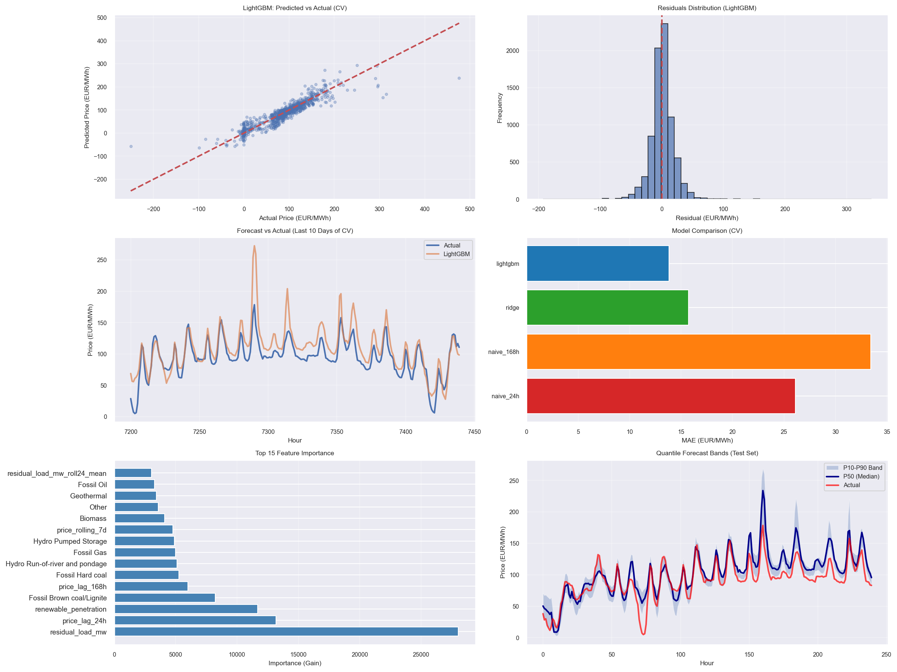
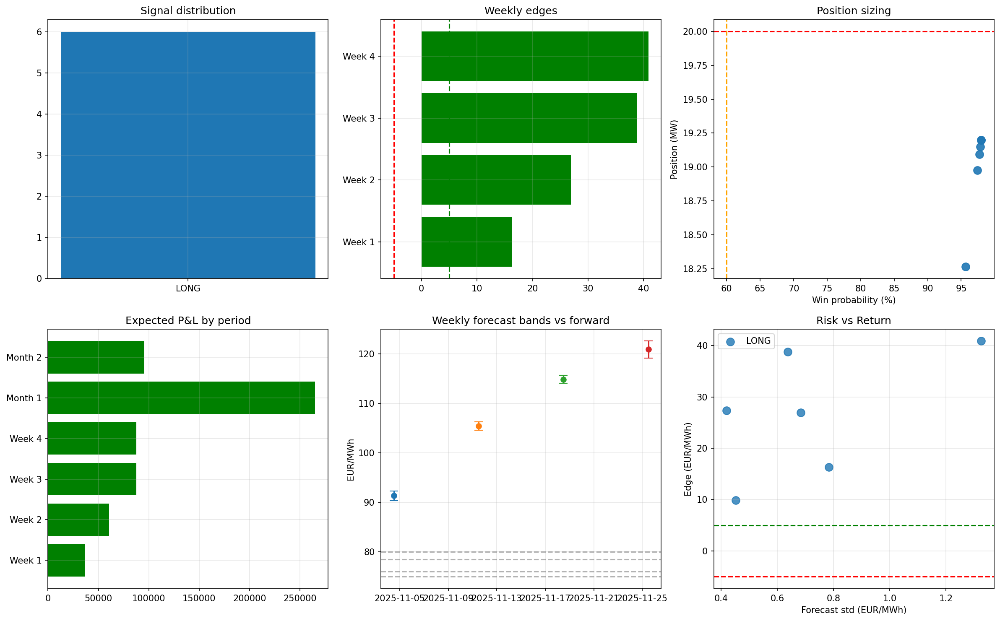

# European Power Fair Value  
## Day-Ahead Forecasting and Prompt Curve Trading Signal Prototype  

**Nikshay Jain**  
**Email:** thenikshayjain@gmail.com  
**Repository:** https://github.com/Nikshay-Jain/eu-power-fair-value  

---

## Executive Summary

This project delivers a complete, reproducible prototype of a **fundamental power-market forecasting and trading signal pipeline**. It ingests public European electricity market data, builds predictive models for Day-Ahead (DA) prices, validates them rigorously using walk-forward time-series cross-validation, and translates probabilistic forecasts into **prompt-curve trading signals** with explicit risk controls.  

In addition, the workflow integrates a **programmatic AI component** that automatically generates trader-style commentary from computed metrics, with built-in numeric fact-checking to ensure auditability and prevent hallucinated outputs.

The result is a realistic research-to-trading pipeline closely reflecting how quantitative energy trading desks develop fair-value views and express them on the forward curve.

---

## 1. Data Engineering and Quality Assurance

### Data Sources and Ingestion

Public ENTSO-E transparency data was used to build an hourly dataset for a chosen European power market. Raw archives include:

- Day-Ahead prices  
- System load  
- Generation by technology  
- Cross-border flows  

These raw ZIP files are stored in `data/` and processed by `part_1.py`.

### Cleaning and Alignment

Key engineering steps:

- Strict hourly time alignment across all sources  
- Full UTC timestamp normalization with DST-safe handling  
- Merge of price, load, generation, and flow tables  
- Detection and removal of duplicates  
- Negative and extreme value checks  
- Gap-filling with time-series aware interpolation  

### Automated QA Reporting

Automated QA outputs are produced in `qa_report/`, including:

- Missingness by column and time block  
- Duplicate timestamp checks  
- Outlier summaries  

This ensures downstream modeling receives a consistent, auditable dataset.

**Primary Output**

- `data/cleaned_energy_data.csv` — QA-cleaned hourly dataset  

#### Data QA and Correlation Visuals

---

## 2. Feature Engineering and Forecasting

### Feature Construction

`part_2.py` builds fundamental drivers reflecting power-system economics:

- Residual load (load minus renewables)  
- Renewable penetration ratios  
- Thermal generation availability proxies  
- Lagged prices  
- Rolling statistics  
- Interaction features  

The engineered dataset is stored as:

- `data/featured_energy_data.csv`

### Modeling Strategy

Two categories of models were implemented:

**Baselines**

- Naive last-day  
- Naive last-week  

**Machine Learning**

- Regularized regression  
- Gradient boosting (LightGBM)  
- Quantile regression for probabilistic forecasts (P10 / P50 / P90)  

### Time-Series Validation

Walk-forward cross-validation ensures realistic out-of-sample testing without leakage. Performance metrics include:

- MAE / RMSE on price levels  
- Tail MAE on extreme price hours  

Model performance summaries are saved as:

- `results/part2_cv_summary.csv`  
- `results/part2_forecasting_results.png`  

#### Forecasting Results Visualization

### Feature Importance Insights

Global feature importance confirms economic interpretability:

Top global drivers:

- **Residual load** — 33.5% importance  
- **Brown coal / lignite generation** — 10.7%  
- **Other thermal generation** — 7.4%  
- **Hard coal** — 6.1%  
- **Gas** — 4.8%  

These align with expected merit-order price formation in European markets.  

### Final Forecast Output

- `results/part2_final_predictions.csv` — Hourly P10 / P50 / P90 forecasts  
- `submission.csv` — Out-of-sample DA predictions  

---

## 3. Prompt Curve Translation

Forecasts alone do not form a trading view.  
`part_3.py` converts hourly probabilistic DA forecasts into **tradable prompt-curve signals**.

### Monte-Carlo Delivery-Period Aggregation

Hourly quantile forecasts are sampled via Monte-Carlo simulation and averaged to produce **weekly and monthly delivery-period price distributions**:

- Expected mean (P50)  
- Uncertainty bands (P10 / P90)  
- Period volatility  

### Forward Curve Comparison

For each delivery period:
Edge = Forecast_P50 − Forward_Price

This defines fair-value mispricing against the forward curve.

### Trading Metrics Produced

- Expected delivery-period mean price  
- Distribution bands  
- Edge versus forward  
- Monte-Carlo win probability  
- Sharpe-like risk metric  
- Confidence-weighted MW position sizing  
- Conservative expected P&L  

### Risk and Invalidation Logic

Each signal is paired with:

- Edge erosion checks  
- Low-confidence warnings  
- Wide uncertainty band flags  
- Quantile calibration diagnostics  
- Automated “HOLD / REDUCE / CLOSE” decisions  

### Example Trading Signals

**Week 1 Delivery**

- P50 forecast: **89.53 EUR/MWh**  
- Forward price: **75.00 EUR/MWh**  
- Edge: **+14.53 EUR/MWh**  
- Win probability: **96.7%**  
- Signal: **LONG**  
- Position: **~19 MW baseload**  
- Expected P&L: **~32k EUR (conservative)**  

**Month 1 Delivery**

- P50 forecast: **105.26 EUR/MWh**  
- Forward price: **70.00 EUR/MWh**  
- Edge: **+35.26 EUR/MWh**  
- Signal: **LONG**  
- Expected P&L: **~341k EUR**

Similar structured signals are produced for Weeks 1–4 and Months 1–3.

### Visual Signal Dashboard

`results/part3_trading_signals.png` illustrates:

- Signal distribution (Long / Short / Neutral)  
- Weekly edges vs thresholds  
- Position sizing vs win probability  
- Risk vs return scatter  
- Forecast bands vs forward prices  

This provides an at-a-glance trading summary.

### Machine-Readable Outputs

- `results/part3_trading_signals.csv` — Full signal table  
- `results/part3_trading_reports.txt` — Human-readable trader reports  

---

## 4. AI-Generated Trader Commentary

A programmatic LLM module (`part_4.py`) automates daily trader notes.

### Process

1. Reads feature importance and primary trading signal  
2. Builds a deterministic factual note  
3. Optionally refines phrasing via LLM  
4. Performs numeric fact-checking to ensure no invented values  
5. Logs prompts, responses, and validation outcomes  

### Example Generated Note

> *Bullish signal for Week 1 (+14.53 EUR/MWh vs forward). Model fair-value (P50) = 89.53 EUR/MWh; forward = 75.00 EUR/MWh.  
> Top drivers: residual_load_mw (33.5% model importance): −77.5% recent change.  
> Win probability = 96.7%. Monitor wind forecast revisions and forward moves > ±3 EUR/MWh.*

### AI Audit Outputs

- `results/part4_trader_commentary.txt`  
- `results/part4_trader_commentary.json`  
- `results/part4_ai_log.txt`  

This satisfies controlled, auditable AI usage in an engineering workflow.

---

## 5. Trading Interpretation

The pipeline expresses a clear **DA → Curve fair-value strategy**:

- Positive edge → Long prompt baseload  
- Negative edge → Short prompt baseload  
- Position size scaled by confidence and risk  
- Automated invalidation rules guide exposure reduction  

This structure directly mirrors professional desk practices for:

- Prompt month exposure  
- Week-ahead shaping  
- Risk-adjusted position sizing  

---

## 6. Reproducibility and Engineering Quality

- Deterministic random seeds for Monte-Carlo simulations  
- Full timestamp and DST safety  
- No proprietary or paid data dependencies  
- Automated QA and validation artifacts  
- Logged AI prompts and responses  
- Single-command reproducible pipeline  

---

## 7. Key Deliverables

| Artifact | Purpose |
|----------|---------|
| `data/cleaned_energy_data.csv` | QA-cleaned dataset |
| `data/featured_energy_data.csv` | Feature-engineered dataset |
| `results/part2_cv_summary.csv` | Forecast validation metrics |
| `results/part2_final_predictions.csv` | Quantile forecasts |
| `results/part3_trading_signals.csv` | Trading signals |
| `results/part3_trading_signals.png` | Visual trading dashboard |
| `results/part3_trading_reports.txt` | Human-readable reports |
| `results/part4_trader_commentary.txt` | AI trader note |
| `submission.csv` | Out-of-sample predictions |

---

## Conclusion

This project demonstrates a complete quantitative energy-trading research pipeline:

- Fundamental data engineering  
- Probabilistic forecasting with rigorous validation  
- Direct translation into actionable curve-trading decisions  
- Automated AI-assisted commentary with audit controls  

The result is a realistic prototype of how modern energy trading desks build and deploy fair-value views on the power forward curve.

---